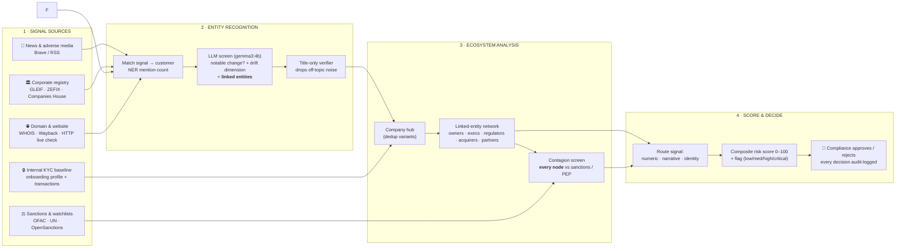
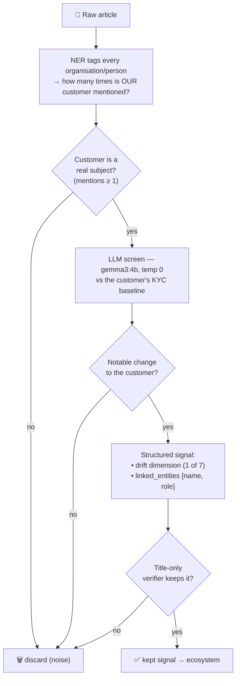
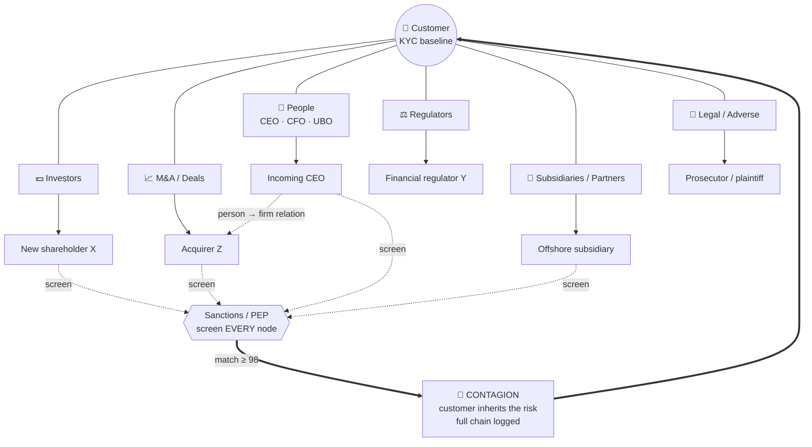
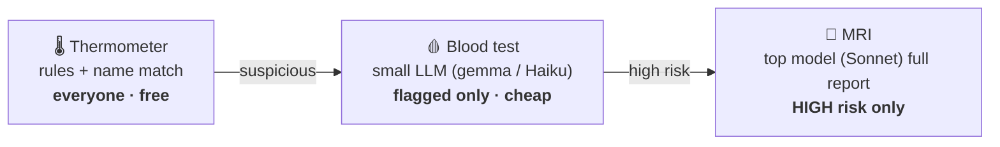

# How We Detect KYC Drift — Architecture Flow

> A pitch-ready walkthrough. Each section: one plain-English line, then the real mechanism.
> The differentiator is **Section 3** — we don't just read news about a company, we rebuild the
> company's *entire surrounding ecosystem* and screen every player in it.

**KYC drift** = the slow gap between *who the customer said they were at onboarding* and *who they
actually are now*. A clean company can quietly drift: a new hidden owner, a move offshore, a pivot to
crypto, a sanctioned partner. No single event trips an alarm — but the bank's original approval is no
longer valid. We catch that, continuously.

---

## The whole thing in one picture

> **Plain English:** We pull public signals → figure out *who* each signal is really about →
> map the company's whole network → score the drift cheaply, escalate the risky few, and a human
> signs off on every decision.



---

## 1 · Signal sources — what we watch

> **Plain English:** Most risk shows up *outside* the bank first. We watch five public feeds, and
> compare them to the one private thing the bank already holds: the onboarding file.

| Layer | Source | What it tells us |
|---|---|---|
| Public | 📰 News & adverse media | lawsuits, fraud, pivots, leadership shake-ups |
| Public | ⚖️ Sanctions & watchlists (OFAC · UN · OpenSanctions) | is this name — or anyone near it — flagged |
| Public | 🏛️ Corporate registry (GLEIF · ZEFIX · Companies House) | name change, jurisdiction move, legal-form change |

| Public | 🌐 Domain & website (WHOIS · Wayback) | business-activity change, ownership of the web presence |
| **Private** | 🔒 **Internal KYC baseline** | declared business, expected volumes, countries, owners (UBOs), risk rating |

The baseline is the **ruler**. Every public signal is measured as a *distance from* it. Drift is that
distance growing.

---

## 2 · Entity recognition — who is this signal actually about?

> **Plain English:** A news article isn't a fact about one company — it's a small map of players.
> We find the customer in it, decide if something real changed, and — critically — pull out *everyone
> else named*: the acquirer, the new shareholder, the regulator, the incoming CEO.



**The seven drift dimensions the screener classifies into** (mirroring the bank's risk table; the
backend expands these to ~19 weighted categories):

`business_model_change` · `activity_volume_change` · `key_personnel_change` · `ownership_change` ·
`jurisdiction_structure_change` · `adverse_media_legal` · `sanctions_regulatory`

**Why this is cheap and safe:** the small local model only *selects and tags* — it never scores
severity or recommends action. A second 1.2B model re-checks the *headline only* and drops articles
where the customer is just background (e.g. "Air Force One" stories that merely name Boeing as the
plane-maker). Severity, scoring and recommendations happen downstream, deterministically.

**The key output is `linked_entities`.** For every kept article the model returns the *other* players
and *how they relate* to the change. That list is the raw material for the ecosystem graph.

---

## 3 · Ecosystem analysis — the differentiator

> **Plain English:** We don't analyse a company in isolation. We rebuild the network *around* it —
> its investors, owners, regulators, acquirers, executives, subsidiaries — and then we screen **every
> single one of them**. A spotless customer with a sanctioned new shareholder is *not* spotless. Risk
> travels through the network. We call that **contagion**.

Three things happen here:

**(a) Build the network.** Every `linked_entity` becomes a node hanging off the company hub. Names are
**canonicalised** so `Boeing`, `Boeing Inc` and `The Boeing Company` collapse to one node (we strip
corporate suffixes and possessives). Each role is sorted into a **role bucket** by what the entity
*is/does* in the story:

> 💵 Investors · 🏦 Investees · ⚖️ Regulators · 🤝 Partners · 🥊 Competitors · 📈 M&A / Deals ·
> 🚨 Legal / Adverse · 👤 People (CEO/CFO/UBO) · 🏢 Subsidiaries · 🚚 Suppliers · 🧑‍💼 Customers · 📰 Media

**(b) Screen the whole network.** Each node — not just the customer — is run against the sanctions /
PEP lists. A match on *any* node is a strong, explainable signal.

**(c) Propagate.** A hit on a linked entity flows *back* to the customer as inherited risk, with the
full chain kept for audit ("clean company → new shareholder → on OFAC list").



On top of the graph we paint two extra layers the eye can read instantly:

- **Sentiment heat-map** — each node/cluster is tinted by how adverse its coverage is (risk polarity
  from VADER-style scoring), so a company drowning in negative news *glows red* before any score.
- **Registry-drift overlay** — companies whose official registry record changed (jurisdiction, legal
  form, status) get flagged on the hub directly.

**Why this wins:** competitors will show "company X is in bad news." We show "company X just took on a
shareholder who controls an entity two hops away that's on a sanctions list" — the structural,
slow-moving drift that one-company adverse-media tools structurally cannot see.

---

## 4 · Score, escalate, decide

> **Plain English:** Most signals are noise, so we filter cheaply and only spend real money (and a big
> AI) on the few that matter. A human approves every flag. Nothing is ever auto-actioned.

**Routing first** (deterministic, no AI — we know the type from the source):

| Signal type | Method | Why |
|---|---|---|
| numeric (transactions, funding) | rule arithmetic (% deviation) | subtraction is exact, free, explainable |
| identity (names, owners) | exact / fuzzy match + 2nd identifier | catches variants without false positives |
| narrative (news, registry, web) | embeddings → LLM | meaning has to be *compared*, not matched |

**Cost triage — like a hospital:**



Everything funnels into **one composite score** — news *and* transactions *and* network contagion all
contribute to the same weighted sum (weights owned by compliance in a policy file, not by the AI):

```
score = Σ (magnitude × weight/MAX_WEIGHT × confidence)        flag: <30 low · <60 medium · ≥60 high
        − positive signals (softened)                         hard sanctions hit → CRITICAL
```

Then the **human gate**: a compliance officer validates/dismisses each signal and approves/rejects the
case. Advisory only, every decision immutably logged, confidence scores and source citations attached.
A case advances *only* on explicit analyst action — never on silence.

---

## The one-liner to close on

> **"Adverse-media tools tell you a company is in the news. We rebuild the company's entire ecosystem
> — its owners, partners, regulators and acquirers — screen every one of them, and catch the moment a
> customer drifts away from who the bank onboarded. Continuously, explainably, for pennies per
> customer."**
